# Sege - Coffee machine family business
## CI-project-1
### HTML & CSS project for Code Institute
Landing page for the fictional family company in a fictional town based on true brand named "Sage". The business is owned by a father and 2 sons.
Their target customers are individuals and businesses. Currently have 2 products on market and 1 coming soon available for preorder.
The website has 3 pages /HOME/ABOUT/CONTACT.

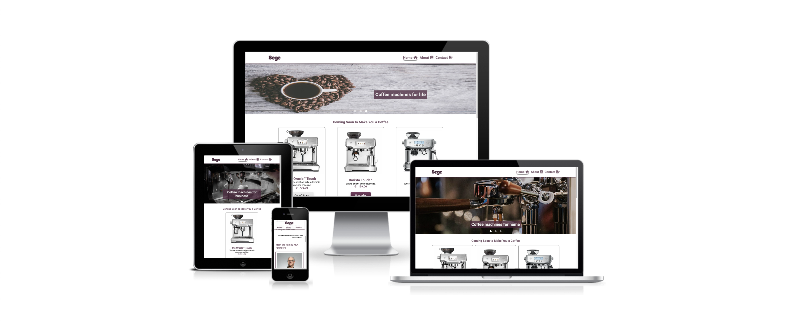

## Features - Existing

### Common
#### Navbar
Navbar is fixed to the top soo it's easier to navigate website whenever you are.
Navbar also includes css ".active" class which indicates current page we are browsing.
Of course logo is also includes.

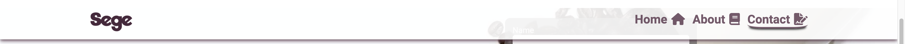
#### Footer
Footer that we can split into 3 parts.
1. Logo and quick navigation.
2. Contact details
3. About company and social media links.

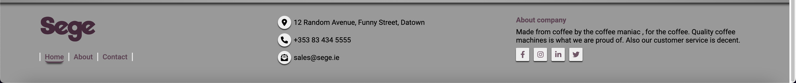

### Home/Index page
#### Carousel
Plain HTML & CSS carousel without autoplay functionality. I tried to keep project Javascript free and that the best I could do.
HTML & CSS part is based on:

Carousel created by Anca Spatariu
https://codepen.io/ancaspatariu/pen/WpQYOP

Plenty changes were done to make the carousel useful for my project.

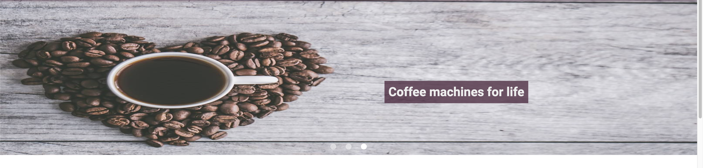
#### Product cards

Currently, there are only 3 products. To entertain customer who is browsing a website I added
hover effect which increases products img size, lifts it a little and leaves a box shadow underneath.
Buttons are NOT working currently.

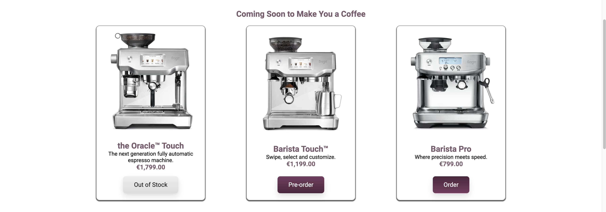

#### Secret keys - products pros
This part showcases the most important parts of every product created by Sege.
Every "key" element unlocks the lock on of every secret formula element. It's done by the magic of "hover".
It's only working on desktop devices where "hover" has the most useful. On mobile devices it would be harder to control and annoying for customer.
That why on mobile devices "Lock" icon is removed and whole text is seen all the time.

#### Newsletter

If customer wants to know for example when is going to be released new Sege coffee machine model. Then he or she can sign up on newsletter and stay updated about everything.
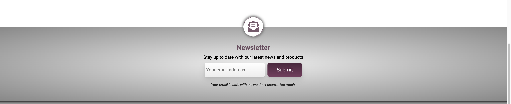

### About Page
#### Hero
Header implicating that company is founded by father and sons who are "dreamers" and trying to reach high.
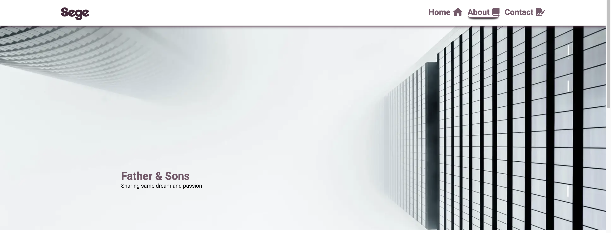

#### Founders description
Short bio about each of founders with hover effect on each image pseudo-element ::after.
frame location is changing according to the screen width.
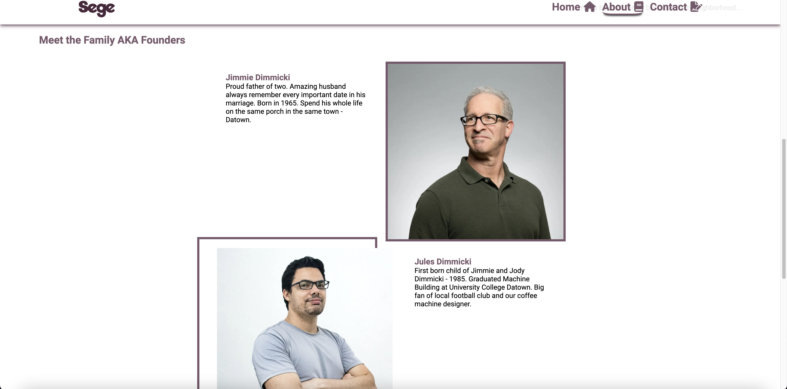

### Contact Page
#### Contact Form
Contact form implemented in header part. Form on submission is opening new window and form is submitted into Code Institute form dumper.
Form validation is covered by HTML. Below Header/Contact form are other contact details provided that may help reach out to company.
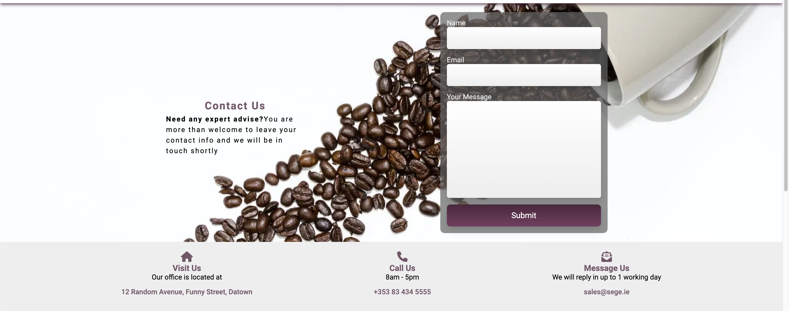

#### Google Maps
To make it easier to find a company I embed google map iframe provided by
https://www.maps.ie/create-google-map/

Thanks to whom I didn't have to provide my API key.
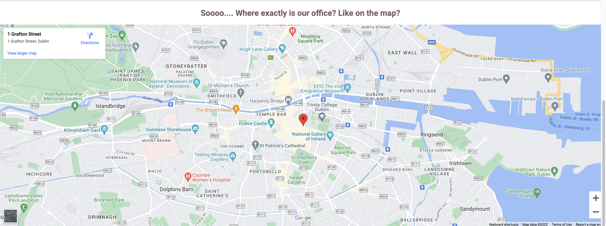

## Features - To be implemented

Implement buttons action on product cards by redirecting to new pages with products details or to modal box with details and purchase mechanism.

Rebuild carousel based on JavaScript and autoplay functionality instead of plain HTML and CSS.

# Testing
## Lighthouse results
### Index/Home desktop
Performance loses due using carousel made only with HTML & CSS
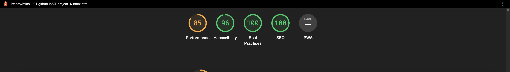
### Index/Home mobile
Performance loses due using carousel made only with HTML & CSS
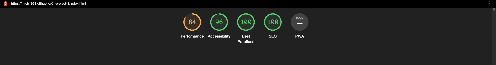
### About desktop
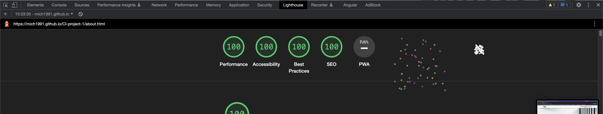
### About mobile
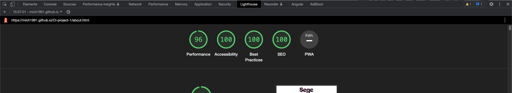
### Contact desktop
Performance loses due embedding Google Maps from third party source. Can't fix that at this moment.
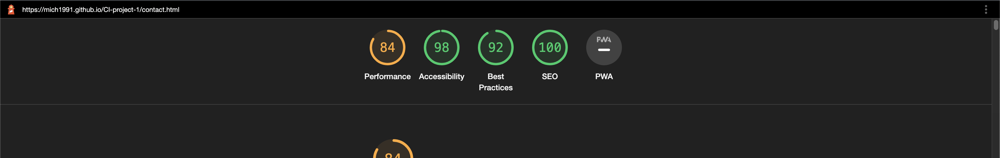
### Contact mobile
Same story. Performance loses due embedding
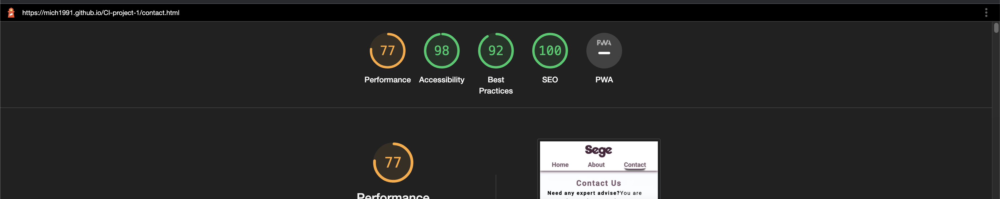

## HTML validator
I used https://validator.w3.org/ for html validation purpose
### Index
4 errors occur all of them appeared in carousel. Since I am not author of carousel and I want to keep project "pure" (avoid bootstrap, JS, jquery etc.) I have to leave it like that.
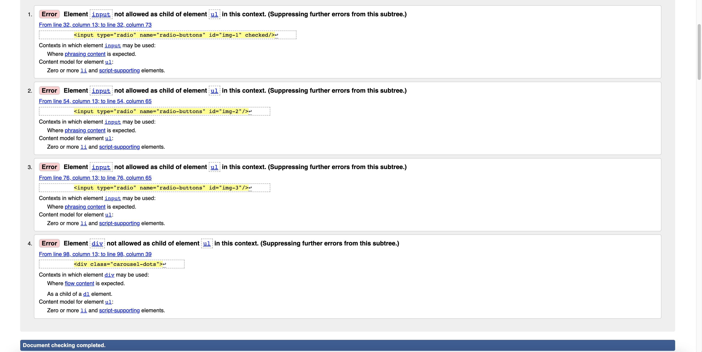
### About

### Contact

## CSS validator
I used https://jigsaw.w3.org/css-validator/ for CSS validation purpose.
Some errors occur during tests. Source of error is font awesome icons that I am using from cdn.
That's why I will only test part of CSS written by me.
### index.css
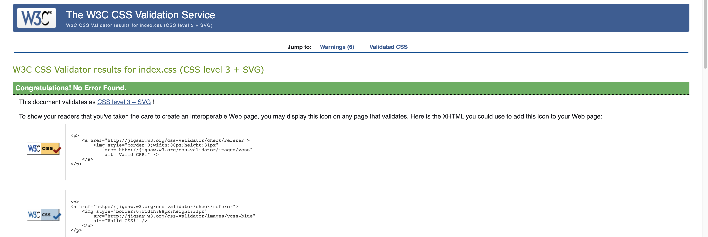
### about.css
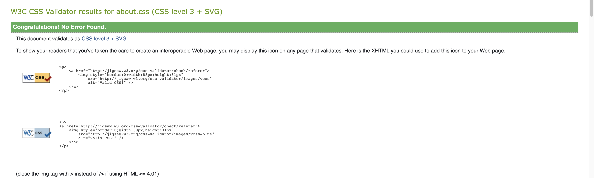
### contact.css
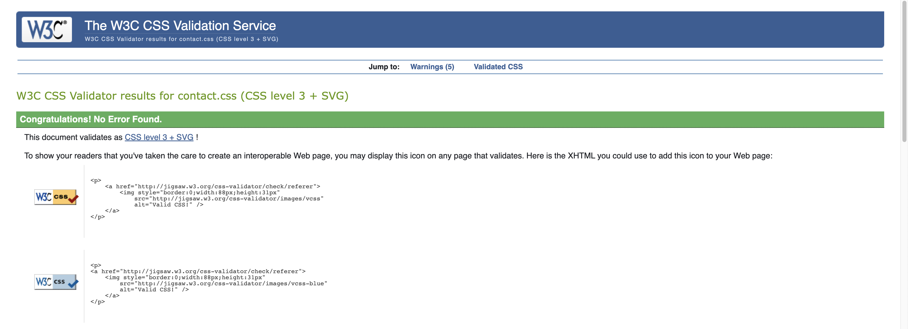
### layout.css
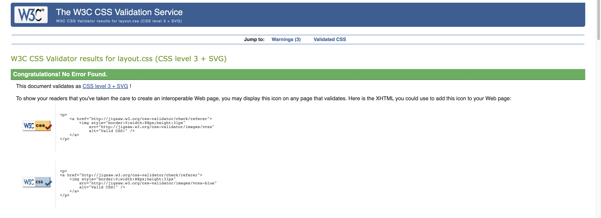
### carousel.css
I am not author of this part, but I have made some changes in the file so to fit my project.
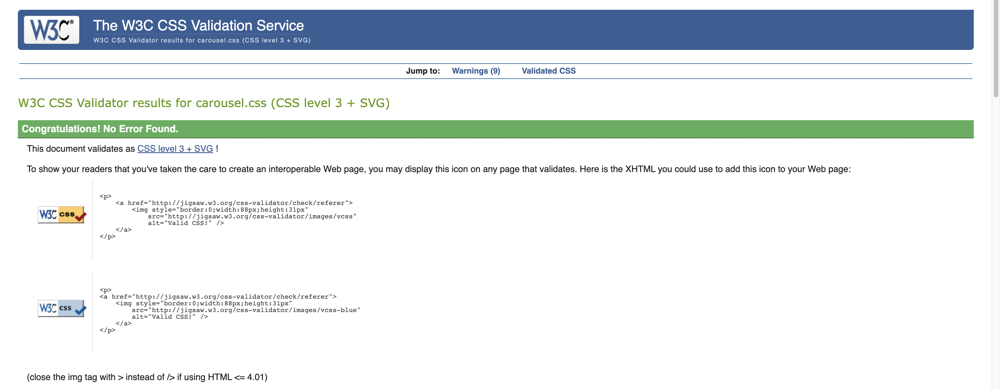

## Technologies used
* HTML
* CSS
* PHPStorm IDE
* Google Chrome Developer Tools
* Mozilla Firefox Developer Tools
* [Font Awesome](https://fontawesome.com/)
* [Google Fonts](https://fonts.google.com/)
* [Unsplash](https://unsplash.com/)

###images used from Unsplash : 
[

    {
    author: Calugar Ana Maria,
    URL: https://unsplash.com/photos/BHeueUanvrU
    },
    {
    author: Kevin Schmid,
    URL: https://unsplash.com/photos/ftA71vetxuo
    },
    {
    author: Jessica Lewis,
    URL: https://unsplash.com/photos/ftA71vetxuo
    },
    {
    author: Math,
    URL: https://unsplash.com/photos/6GDW9BVdmkw
    },
    {
    author: Vladislav Klapin,
    URL: https://unsplash.com/photos/SymZoeE8quA
    },
    {
    author: Kaleb Tapp,
    URL: https://unsplash.com/photos/J59wWPn09BE
    },
    {
    author: Joel Filipe,
    URL: https://unsplash.com/photos/VuwAfoHpxgs
    },
    {
    author: Foto Sushi,
    URL: https://unsplash.com/photos/6anudmpILw4
    },
    {
    author: Yogendra Singh
    URL: https://unsplash.com/photos/HrpYHchKb5Y
    },
    {
    author: Jonas Kakaroto,
    URL: https://unsplash.com/photos/Fs8ZFfVh-cg
    }
]

### images of products and description used from :
* [Sage Appliances](https://www.sageappliances.com/uk/en/products/espresso.html)
* [O'Learys Expert](https://expertkerry.ie/)

## Credits
* Huge thanks to my mentor [Guido Cecilio Garcia Bernal](https://github.com/guidocecilio) guided me throughout this project.
