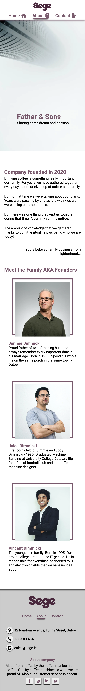
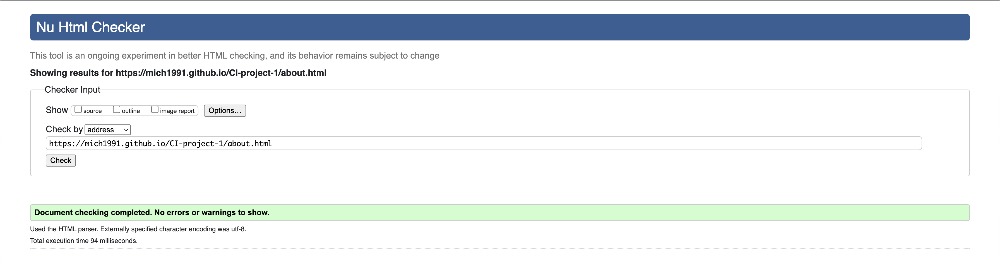

# Sege - Coffee machine family business
## CI-project-1
### HTML & CSS project for Code Institute
Landing page for the fictional family company  in a fictional town based on true brand named "Sage". The business is owned by a father and 2 sons.
Their target customers are individuals and businesses. They are producing high quality coffee machines.

[View website in GitHub Pages](https://mich1991.github.io/CI-project-1/index.html)

[View website in Netlify](https://mellifluous-frangollo-e80838.netlify.app/)

#### This website is made up of the following pages:

1. Home/Index
2. About
3. Contact

#### The business goals for this website are:

1. Sell products
2. Built up customer curiosity about products through letting them know about "4 secret, keys formula"
3. Builds clients email database through newsletter
4. Provide contact and all necessary details for customers to reach company.
5. Provide support
6. Get customer familiar with a brand, and it's story.

#### The user goals of this website are:

1. As recurring or first-time visitor, I want to easily find what the products look like and what are theirs prices.
2. Secondly I am interested about what makes theirs products so unique.
3. I would like to be updated if new products got realised.
4. As a first-time visitor I would like to learn a little more about brand it's self.
5. As a recurring or first-time visitor I would like to be provided with easy way to contact company. 

## Features - Existing

### Common
#### Navbar
Navbar is fixed to the top soo it's easier to navigate website whenever you are.
Navbar also includes css ".active" class which indicates current page we are browsing.
Of course logo is also includes.

#### Footer
Footer that we can split into 3 parts.
1. Logo and quick navigation.
2. Contact details
3. About company and social media links.

### Home/Index page
#### Carousel
Plain HTML & CSS carousel without autoplay functionality. I tried to keep project Javascript free and that the best I could do.
HTML & CSS part is based on:

Carousel created by Anca Spatariu
https://codepen.io/ancaspatariu/pen/WpQYOP

Plenty changes were done to make the carousel useful for my project.

#### Product cards

Currently, there are only 3 products. To entertain customer who is browsing a website I added
hover effect which increases products img size, lifts it a little and leaves a box shadow underneath.
Buttons are NOT working currently.

#### Secret keys - products pros
This part showcases the most important parts of every product created by Sege.
Every "key" element unlocks the lock on of every secret formula element. It's done by the magic of "hover".
It's only working on desktop devices where "hover" has the most useful. On mobile devices it would be harder to control and annoying for customer.
That why on mobile devices "Lock" icon is removed and whole text is seen all the time.

#### Newsletter

If customer wants to know for example when is going to be released new Sege coffee machine model. Then he or she can sign up on newsletter and stay updated about everything.

### About Page
#### Hero
Header implicating that company is founded by father and sons who are "dreamers" and trying to reach high.

#### Founders description
Short bio about each of founders with hover effect on each image pseudo-element ::after.
frame location is changing according to the screen width.

### Contact Page
#### Contact Form
Contact form implemented in header part. Form on submission is opening new window and form is submitted into Code Institute form dumper.
Form validation is covered by HTML. Below Header/Contact form are other contact details provided that may help reach out to company.

#### Google Maps
To make it easier to find a company I embed google map iframe provided by
https://www.maps.ie/create-google-map/

Thanks to whom I didn't have to provide my API key.

## Features - To be implemented

Implement buttons action on product cards to redirect to new pages with products details or to modal box with details and purchase mechanism.

Rebuild carousel based on JavaScript and autoplay functionality instead of plain HTML and CSS.

# Mockup
## Index/Home page
### Desktop

### Tablet

### Mobile

## About
### Desktop

### Tablet

### Mobile

## Contact
### Desktop

### Tablet

### Mobile

# Testing
## User Stories
1. As a first-time visitor I know straight away that the website is about coffee machines for personal use or for business thanks to the carousel.
2. As a first-time or recurring visitor just below a carousel I see what products company is offering and what new is about to release.
3. As a first-time visitor below products I can learn what makes this products special. On desktop devices I can learn that in engaging way by revealing details of each "secret key" by hovering on them.
4. As a first-time or recurring visitor I after learning details and getting excited about products/brand I can sign up for a newsletter or check social media links in footer section.
5. As a first-time visitor I can learn more about company and people behind it. That is a good sign that owners looks trustworthy and not boasting about them self. They are proud about products but humble about themselves. Great indicator of what kind of people they are.
6. As a first-time or recurring visitor I can easily find all necessary details how to contact company or how to get too them. Amount of provided contact details indicates how transparent is company and how much they care for customer to be able to reach them.

(6/6 tests passed :) )

## Lighthouse results
### Index/Home desktop
Performance loses due using carousel made only with HTML & CSS

### Index/Home mobile
Performance loses due using carousel made only with HTML & CSS

### About desktop

### About mobile

### Contact desktop
Performance loses due embedding Google Maps from third party source. Can't fix that at this moment.

### Contact mobile
Same story. Performance loses due embedding

## HTML validator
I used https://validator.w3.org/ for html validation purpose
### Index
4 errors occur all of them appeared in carousel. To fix that I had to change ul and li tags into divs

After fix

### About

### Contact

## CSS validator
I used https://jigsaw.w3.org/css-validator/ for CSS validation purpose.
Some errors occur during tests. Source of error is font awesome icons that I am using from cdn.
That's why I will only test part of CSS written by me.
### index.css

### about.css

### contact.css

### layout.css

### carousel.css
I am not author of this part, but I have made some changes in the file so to fit my project.

## Technologies used
* HTML
* CSS
* PHPStorm IDE
* Google Chrome Developer Tools
* Mozilla Firefox Developer Tools
* [Font Awesome](https://fontawesome.com/)
* [Google Fonts](https://fonts.google.com/)
* [Unsplash](https://unsplash.com/)
* [Photopea](https://www.photopea.com/)

### Images used from Unsplash : 
[

    {
    author: Calugar Ana Maria,
    URL: https://unsplash.com/photos/BHeueUanvrU
    },
    {
    author: Kevin Schmid,
    URL: https://unsplash.com/photos/ftA71vetxuo
    },
    {
    author: Jessica Lewis,
    URL: https://unsplash.com/photos/ftA71vetxuo
    },
    {
    author: Math,
    URL: https://unsplash.com/photos/6GDW9BVdmkw
    },
    {
    author: Vladislav Klapin,
    URL: https://unsplash.com/photos/SymZoeE8quA
    },
    {
    author: Kaleb Tapp,
    URL: https://unsplash.com/photos/J59wWPn09BE
    },
    {
    author: Joel Filipe,
    URL: https://unsplash.com/photos/VuwAfoHpxgs
    },
    {
    author: Foto Sushi,
    URL: https://unsplash.com/photos/6anudmpILw4
    },
    {
    author: Yogendra Singh
    URL: https://unsplash.com/photos/HrpYHchKb5Y
    },
    {
    author: Jonas Kakaroto,
    URL: https://unsplash.com/photos/Fs8ZFfVh-cg
    }
]

### images of products and description used from :
* [Sage Appliances](https://www.sageappliances.com/uk/en/products/espresso.html)
* [O'Learys Expert](https://expertkerry.ie/)

## Credits
* Huge thanks to my mentor [Guido Cecilio Garcia Bernal](https://github.com/guidocecilio) guided me throughout this project.
